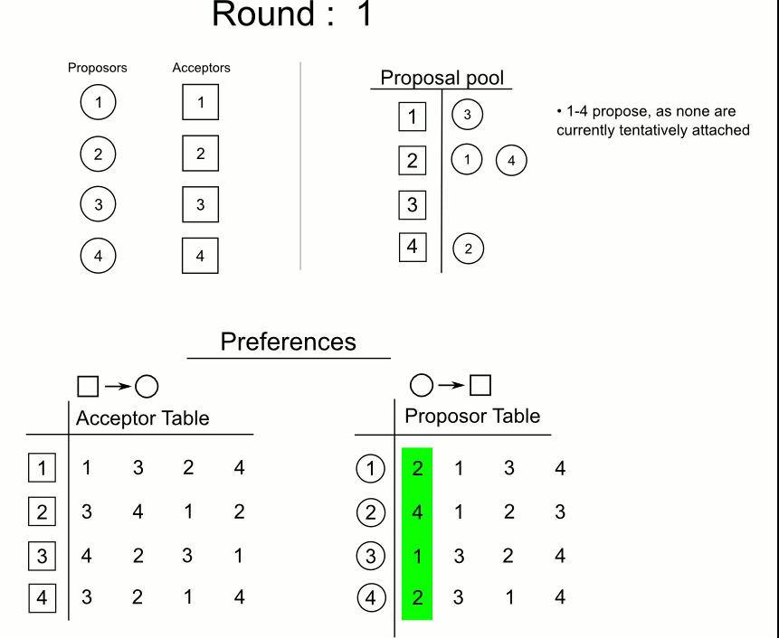

# Algorithms P5 - Stable Marriages

For this workshop we'll implement a version of the **Nobel Prize-winning algorithm** for the stable marriage problem. It's called the [Gale-Shapley](https://en.wikipedia.org/wiki/Gale%E2%80%93Shapley_algorithm) algorithm AKA the "Deferred Acceptance" algorithm.

The Gale Shapley algorithm solves what's called the **Stable Marriage** Problem. Here is the problem framed as marrying men and women: 

> Given $n$ men and $n$ women, where each person has ranked all members of the opposite sex in order of preference, marry the men and women together such that there are no two people of opposite sex who would both rather have each other than their current partners. When there are no such pairs of people, the set of marriages is deemed stable.

This little model however is generally applied to more than marrying men and women. For example, it's the algorithm used to match newly graduated doctors with hospitals, and a variation on it matches kidney patients with organ donors in our hospital system.

The algorithmic question is, given lists of preferences as input, can we find a stable marriage? Can we even guarantee a stable marriage will exist for any set of preferences? The answer to both questions is yes, and it uses an algorithm called deferred acceptance.

Here is an informal description of the algorithm. It goes in rounds. In each round, each man “proposes” to the highest-preferred woman that has not yet rejected him. On the other side, each woman holds a reference to a man at all times. If a woman gets new proposals in a round, she immediately rejects every proposer except her most preferred, but does not accept that proposal. She “defers” the acceptance of the proposal until the very end.



## Your Task

Build a solution `gale_shapley(men, women) -> dict` Where the input is a list of suitors and a list of Suiteds with every one in these lists holding their lists of preferences. The output is a dictionary `suitor -> suited`

Here is a possible way to design a solution:

### Man Class

The `Man(id, preference_list)` class holds the following attributes:

- Its own ID (an `int`)

- A list or array of IDs, which are ordered. So `preference_list[0]` is prefered to `preference_list[1]` and so on

- A method `Suitor.preference()` which points to its current possible reference. It should start by pointing at `preference_list[0]` and every time the Suitor gets rejected in the algorithm, this should point to the next preference.

### Woman Class

The `Woman(id, preference_list)` class holds the following attributes:

- Its own ID (an `int`)

- A list or array of IDs, which are ordered. So `preference_list[0]` is prefered to `preference_list[1]` and so on

- A set of current suitors

- A method `Suited.reject()` which returns all current suitors except the most preferred one

### The Stable Mariage Algorithm

Takes in a list of men and women, loops over suitors trying to find a match until there aren't any unassigned suitors left. Here is the pseudocode for the algorithm:

```
algorithm stable_matching
    Initialize all m ∈ M and w ∈ W to free
    while ∃ free man m who still has a woman w to propose to do
        w := first woman on m's list to whom m has not yet proposed
        if w is free then
            (m, w) become engaged
        else some pair (m', w) already exists
            if w prefers m to m' then
                m' becomes free
                (m, w) become engaged 
            else
                (m', w) remain engaged
            end if
        end if
    repeat
```

Here is some example code of a solution working:

```
men = [
    Man(id=0, preference_list=[0,1,2,3]),
    Man(id=1, preference_list=[2,3,0,1]),
    Man(id=2, preference_list=[1,0,3,2]),
    Man(id=3, preference_list=[3,2,1,0]),
]

women = [
    Woman(id=0, preference_list=[0,1,2,3]),
    Woman(id=1, preference_list=[2,3,0,1]),
    Woman(id=2, preference_list=[1,0,3,2]),
    Woman(id=3, preference_list=[3,2,1,0]),
]

stable_marriage(men, women)
```

output:

```
{0: 0, 
 2: 1, 
 1: 2, 
 3: 3}
```